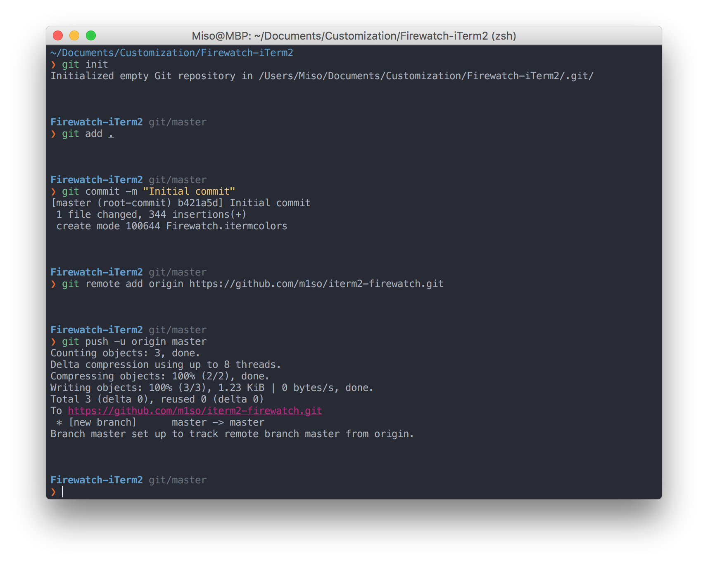

# iterm2-firewatch
> Firewatch inspired theme for iTerm2

The Firewatch theme was created by [Sebastian Szturo](https://github.com/SebastianSzturo) as an [Atom syntax theme](https://atom.io/themes/firewatch-syntax) 
and ported to a HyperTerm theme by [Ben Styles](https://github.com/leeds-ebooks). The theme was originally inspired by the [Firewatch game](http://www.firewatchgame.com/).

This is an iTerm2 port by [Michal Baumgartner](https://github.com/m1so).


## Installation
Download the iTerm2 color preset using 
```bash
wget https://raw.githubusercontent.com/m1so/iterm2-firewatch/master/Firewatch.itermcolors
``` 
and import into iTerm2 (Profiles > Colors > Color presets > Import).
